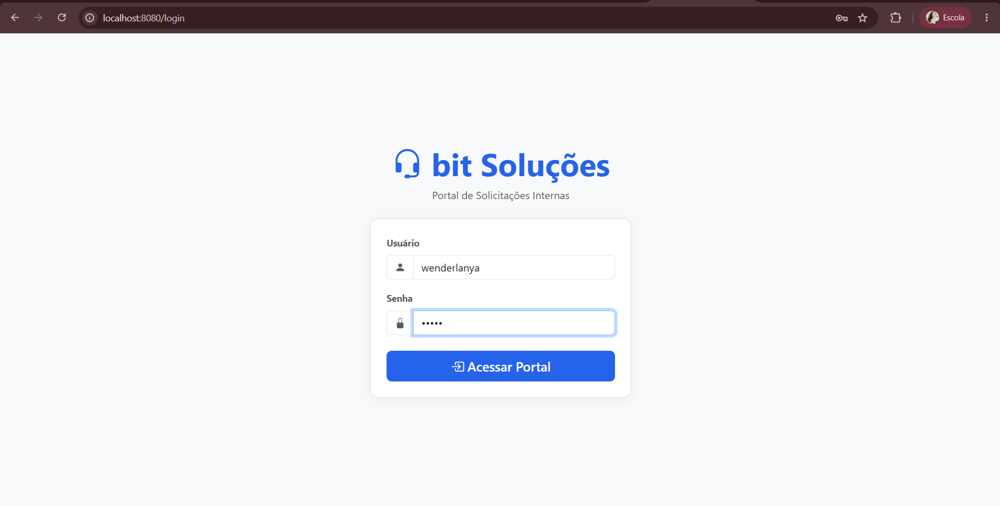
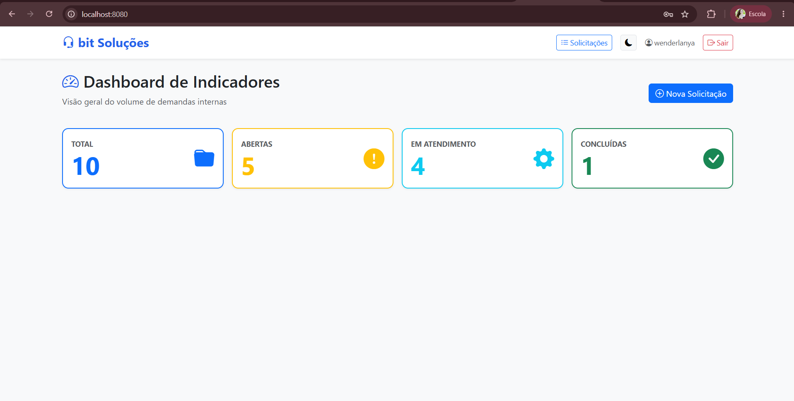
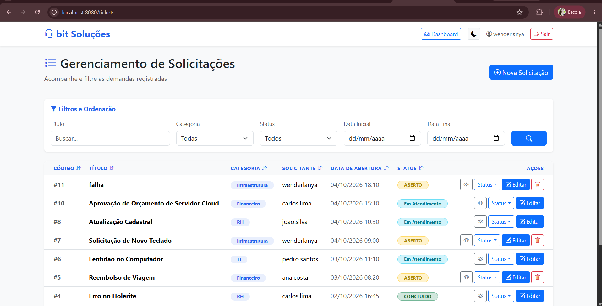

---

# README - Portal de Solicitações Internas (bit Soluções)

Aplicação Web Full Stack desenvolvida para o desafio técnico do Processo Seletivo para **Desenvolvedor(a) de Sistemas Júnior** da **bit Soluções**. O sistema consiste em uma plataforma corporativa para registro, acompanhamento, filtragem, ordenação dinâmica e gestão do ciclo de vida de solicitações internas de colaboradores, contemplando tanto interface web (SSR) quanto endpoints dedicados para API REST.

---

## 1. Pré-requisitos

Para compilar e executar o projeto corretamente, certifique-se de ter os seguintes componentes instalados em sua máquina:

### Linguagem utilizada

* **Java 21 LTS** (JDK versão `21` ou superior).

### Infraestrutura & Containerização

* **Docker Engine** e **Docker Compose** (para execução containerizada recomendada).

### Dependências

O gerenciamento das dependências do projeto é realizado pelo **Apache Maven**. As principais bibliotecas configuradas no arquivo `pom.xml` são:

* **Backend e Persistência:**
* `Spring Boot` (v4.1.1): Framework base para injeção de dependências e controle MVC.
* `Spring Security`: Autenticação customizada, criptografia com BCrypt e gerenciamento de sessão HTTP.
* `Spring Data JPA / Hibernate ORM`: Abstração de dados, mapeamento objeto-relacional (ORM) e otimização via `@EntityGraph`.
* `Flyway Core`: Ferramenta de migração automatizada para versionamento de esquemas DDL e carga de dados iniciais.
* `Jakarta Bean Validation`: Validação declarativa dos formulários.
* `MariaDB Connector/J`: Driver JDBC para comunicação com o banco de dados.


* **API REST & Tratamento de Erros:**
* `Spring MVC / ProblemDetail`: Suporte nativo ao padrão RFC 9457 para respostas de erro em JSON padronizado (`/api/tickets`).


* **Frontend:**
* `Thymeleaf`: Motor de renderização dinâmico de templates (Server-Side Rendering - SSR).
* `Thymeleaf Extras Spring Security`: Integração de permissões de segurança diretamente nas views.
* `Bootstrap 5` e `Bootstrap Icons`: Framework CSS para layout responsivo, limpo em tons de azul/branco e com suporte a Tema Escuro.


* **Testes e DevOps:**
* `JUnit 5` e `Mockito`: Suporte a testes unitários e comportamentais isolados.
* `GitHub Actions`: Pipeline de Integração Contínua (CI/CD) para verificação automática de build e testes a cada *push*.


---

## 2. Instalação e Execução

### Opção A: Execução Completa via Docker Compose (Recomendado)

A aplicação e o banco de dados foram totalmente containerizados, permitindo que todo o ecossistema suba de forma integrada e simultânea com apenas um comando.

1. Certifique-se de que o **Docker Desktop** (ou o daemon do Docker) está ativo em sua máquina.
2. Na raiz da pasta do projeto (onde se encontra o arquivo `compose.yaml`), execute o seguinte comando no terminal:
```bash
docker compose up --build

```


3. O Docker iniciará o contentor do banco de dados MariaDB e, em seguida, compilará e iniciará a aplicação Spring Boot na porta `8080` de forma totalmente automatizada.

---

### Opção B: Execução Nativa (Backend via IntelliJ IDEA & Banco via Docker)

Caso prefira executar o backend de forma nativa pela IDE mantendo apenas o banco isolado no Docker:

1. Suba apenas o banco de dados via Docker Compose:
```bash
docker compose up -d db

```


2. Abra a IDE **IntelliJ IDEA** e selecione a pasta raiz do projeto.
3. Aguarde o Maven carregar as dependências e verifique se o SDK está apontado para o **Java 21**.
4. Inicie o backend executando a classe principal:
   `src/main/java/info/bitsolucoes/portal/PortalApplication.java`

*(Nota: A criação das tabelas e as cargas iniciais são executadas de forma 100% automatizada pelo **Flyway Migration** em ambas as opções).*

---

## 3. Configuração

### Variáveis de ambiente

A aplicação utiliza um arquivo **`.env`** localizado na raiz do projeto para desacoplar e proteger credenciais sensíveis. Um template seguro (**`.env.example`**) é fornecido no repositório.

Certifique-se de criar ou ajustar o arquivo `.env` na raiz com as seguintes variáveis:

```env
DB_USER=root
DB_PASSWORD=usuario123

```

> **Nota de Segurança:** O arquivo `.env` real encontra-se listado no `.gitignore` para impedir a exposição de credenciais em repositórios remotos.

### Credenciais de demonstração

Para facilitar os testes imediatos, os usuários de demonstração foram populados na base de dados por meio da migração automatizada do Flyway.

Todos os utilizadores abaixo compartilham a mesma **senha padrão de acesso:** `12345`

| Utilizador | Setor / Perfil de Acesso |
| --- | --- |
| **wenderlanya** | Perfil Padrão / TI |
| **joao.silva** | Perfil Padrão / RH |
| **maria.souza** | Perfil Padrão / Compras |
| **carlos.lima** | Perfil Padrão / Financeiro |
| **ana.costa** | Perfil Padrão / Infraestrutura |
| **pedro.santos** | Perfil Padrão / Geral |

---

## 4. Testes Automatizados

Para validar todos os testes unitários do projeto (serviços, repositórios e controladores) utilizando a interface gráfica do IntelliJ:

1. No painel lateral esquerdo (**Project Explorer**), navegue até a pasta de testes:
   `src/test/java/info/bitsolucoes/portal`
2. Clique com o botão direito em cima do pacote `portal` e selecione **Run 'All Tests'**.
3. O painel inferior **Run** exibirá o resultado da execução com os indicadores em verde indicando sucesso absoluto.

---

## 5. Acesso e Endpoints

### Acesso à Interface Web

1. Abra o navegador web de sua preferência.
2. Acesse a URL local:
```text
http://localhost:8080

```


3. Faça login utilizando um dos utilizadores de demonstração (ex: utilizador `wenderlanya` e senha `12345`).

### Acesso à API REST

Caso deseje consumir os dados da aplicação de forma desacoplada em formato JSON, a API encontra-se disponível no endpoint:

* `GET /api/tickets` (Protegido por autenticação / tratado com padrão RFC 9457 em caso de exceções).

---

## 6. Evidências de Funcionamento

### 1. Tela de Login do Portal


### 2. Dashboard de Solicitações


### 3. Gerenciamento dos Tickets
